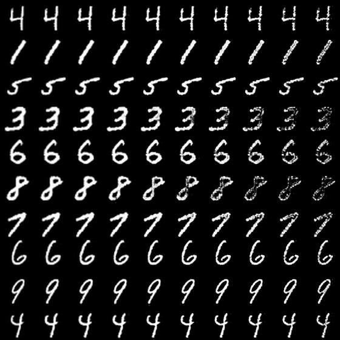

### Fully convolutional autoencoder
Autoencoder that contains no dense layers. The encoding layer is calculated by global mean pooling over the last convolutional layer, which has as many filters as there are dimensions in the code.

The resulting autoencoder is somewhat scale-invariant and can effectively encode images larger or smaller than the training set. The current architecture depends on Lasagne's InverseLayer, which allows the decoding layer access to the gradients in the encoding layer. The next step is to remove this dependency, which will make training more difficult.

Example output - leftmost column is original image, second is original-size reconstruction, and each column to the right is reconstruction after upscaling the original image by 20% along each dimension.

### DCGAN autoencoder
Inspired by Radford et al 2015 ( http://arxiv.org/abs/1511.06434 ). An attempt to train an autoencoder using generative adverserial training with the autoencoder acting as the generator network, and a separate discriminator network.

Based on code found here:
https://github.com/Newmu/dcgan_code

This approach trains poorly; the generator seems to find the degenerate solution of outputting a single solution designed to exploit the discriminator. The architecture used is significantly different from DCGAN, in particular in the use of max-pooling layers rather than strided convolutions.

### Rotated convolutions
Compares performance obtained on the CIFAR-10 classification task using
- a typical CNN
- a CNN with half as many filters per layer, but each outputs its own activations and those of its weights if rotated 180 degrees
- a CNN with a quarter as many filters per layer, but each filter outputs both its own activations, and those of its weights if rotated 90, 180, and 270 degrees

The architectures used in this experiment were chosen to have relatively few dense layer weights, using a final convolutional layer containing fewer feature maps. The result so far is that reducing the model size by using rotated convolutional featues achieves classification accuracy nearly as good as using a model 2-4x the size, and with further work and/or on certain architectures perhaps performance can be matched or exceeded.

### Dependencies
- theano
- lasagne
- tqdm
- fuel
- hd5py
